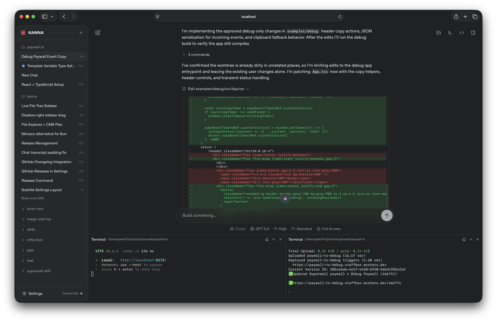

<p align="center">
  
</p>

<h1 align="center">Tinkaria</h1>

<p align="center">
  <strong>A playful workbench UI for Claude Code and Codex</strong>
</p>

<p align="center">
  <a href="https://www.npmjs.com/package/tinkaria"></a>
</p>

<p align="center">
  <picture>
    <source media="(prefers-color-scheme: dark)" srcset="assets/screenshot.png" />
    <source media="(prefers-color-scheme: light)" srcset="assets/screenshot-light.png" />
    
  </picture>
</p>

Tinkaria is a local-first browser workbench for coding agents. It gives Claude Code and Codex a shared UI with project-aware chat, embedded terminals, transcript rendering, session history, and a NATS-backed realtime runtime.

It started as a fork of [jakemor/kanna](https://github.com/jakemor/kanna). Kanna remains the upstream inspiration and original beautiful Claude Code web UI. This fork has since diverged heavily in architecture and product direction.

## Quickstart

```bash
bun install -g tinkaria
tinkaria
```

If Bun is not installed yet:

```bash
curl -fsSL https://bun.sh/install | bash
```

Default URL: `http://localhost:3210`

## What Tinkaria Adds

- Multi-provider chat for Claude Code and Codex
- Embedded terminals with persisted layout
- Project-first sidebar and local project discovery
- Rich transcript rendering for tools, plans, diffs, and structured content
- Session resumption and local history
- Embedded NATS transport with snapshots, events, and command subjects
- Plan-mode approval flows inside the UI
- Local-first event-log persistence

## Install

Global install:

```bash
bun install -g tinkaria
```

Run from source:

```bash
git clone https://github.com/lagz0ne/tinkaria.git
cd kanna
bun install
bun run build
bun run start
```

## Usage

```bash
tinkaria                  # start on localhost:3210
tinkaria --port 4000      # custom port
tinkaria --no-open        # do not open a browser
tinkaria --share          # create a public Cloudflare share URL
tinkaria --remote         # bind 0.0.0.0
tinkaria --host dev-box   # bind a specific hostname or IP
```

`--share` is incompatible with `--host` and `--remote`.

## Requirements

- [Bun](https://bun.sh) v1.3.5+
- A working [Claude Code](https://docs.anthropic.com/en/docs/claude-code) setup
- Optional: [Codex CLI](https://github.com/openai/codex) for Codex support

Embedded terminal support currently targets macOS and Linux through Bun PTY APIs.

## Architecture

[](https://diashort.apps.quickable.co/d/e69a07ad)

The browser connects to an embedded NATS server over WebSocket. Tinkaria uses three internal subject families:

| Namespace | Pattern | Purpose |
|-----------|---------|---------|
| Snapshots | `kanna.snap.*` | Push state for sidebar, chat, settings, terminals |
| Events | `kanna.evt.*` | JetStream-backed terminal and chat event streams |
| Commands | `kanna.cmd.*` | Request/reply mutations from browser to server |

The `kanna.*` subject prefix is an internal protocol detail carried forward from earlier iterations. The product and UI branding are `Tinkaria`.

Key patterns:

- Event sourcing with JSONL logs plus snapshot compaction
- CQRS-style split between persisted write path and derived read snapshots
- Reactive snapshot broadcasting over NATS
- Shared UI shell for multiple coding-agent providers

## Development

```bash
bun run dev
```

Useful commands:

| Command | Description |
|---------|-------------|
| `bun run build` | Production build |
| `bun run check` | Typecheck and build |
| `bun run dev` | Client and server together |
| `bun run dev:client` | Vite client only |
| `bun run dev:server` | Bun server only |
| `bun run start` | Production server |
| `bun run tauri:dev` | Experimental Tauri shell |
| `bun run tauri:build` | Build the Tauri shell |

## Tauri Desktop

The repo includes an experimental Tauri shell under `src-tauri/`.

Current scope:

- hosts the existing Tinkaria UI in a desktop shell
- registers as a desktop renderer over NATS
- answers targeted native `webview.open` commands
- lets transcript smoke links prefer a native controlled webview when the companion is connected

From WSL:

```bash
sudo apt-get update
sudo apt-get install -y libwebkit2gtk-4.1-dev build-essential curl wget file libxdo-dev libssl-dev libayatana-appindicator3-dev librsvg2-dev

bun run start
bun run tauri:dev
```

### Windows Smoke Loop

Current fastest manual loop:

1. In PowerShell, start Tinkaria:

```powershell
bun install
bun run start
```

2. In a second PowerShell window, start the companion:

```powershell
bun run tauri:dev
```

3. Open the root page in the browser or use the Tauri main window.
4. On the Local Projects page, use the `Desktop Smoke` card.
5. Click `Local smoke target` or `Remote smoke target`.

Expected behavior:

- if the Tauri companion is connected, the click is steered to a native controlled webview
- if no desktop renderer is connected, the link falls back to the normal browser path

## Data Storage

Tinkaria stores local state under:

- prod: `~/.tinkaria/data`
- dev: `~/.tinkaria-dev/data`

On startup, Tinkaria will migrate older `~/.kanna` and `~/.kanna-dev` roots forward automatically.

Main files:

| File | Purpose |
|------|---------|
| `projects.jsonl` | Project open/remove events |
| `chats.jsonl` | Chat create/rename/delete events |
| `messages.jsonl` | Transcript entries |
| `turns.jsonl` | Agent turn lifecycle events |
| `snapshot.json` | Compacted startup snapshot |

## Fork Lineage

Tinkaria is a fork of [Kanna](https://github.com/jakemor/kanna), created by [@jakemor](https://github.com/jakemor). Kanna is the original inspiration for the UI direction and deserves explicit credit.

This fork diverged by:

- introducing embedded NATS as the runtime transport
- expanding into a broader Claude Code + Codex workbench
- adding local-first event-log persistence and richer session management
- exploring Tauri-based desktop shell support

## License

This repository retains the upstream license terms in [LICENSE](LICENSE). Keep that file intact when redistributing.
